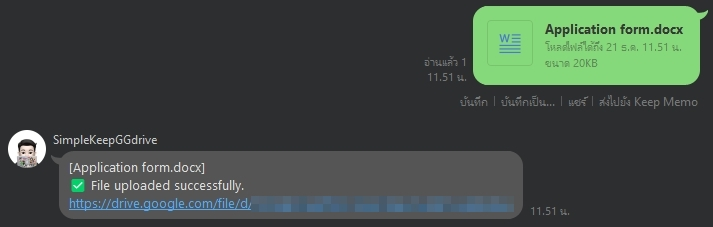
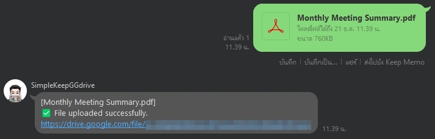
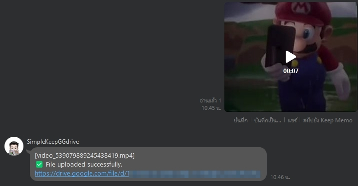
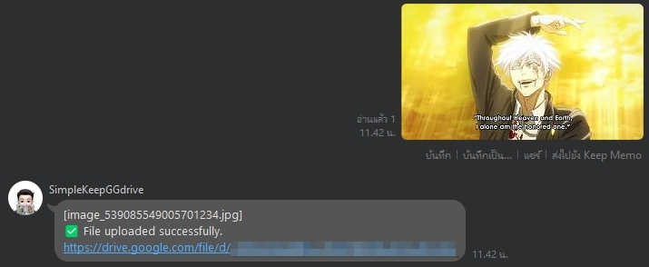
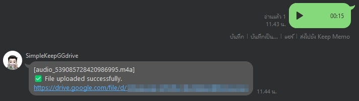
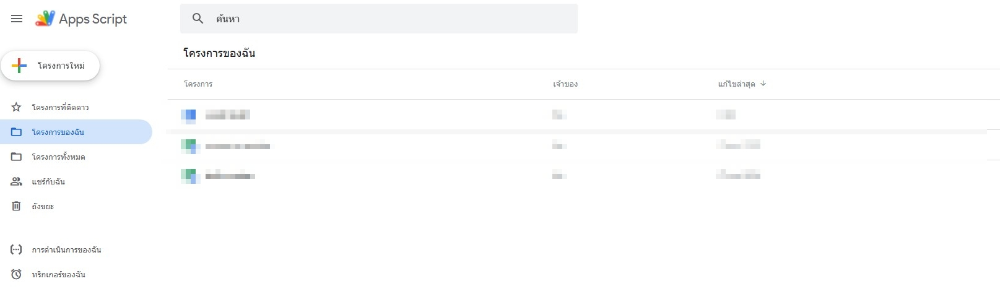
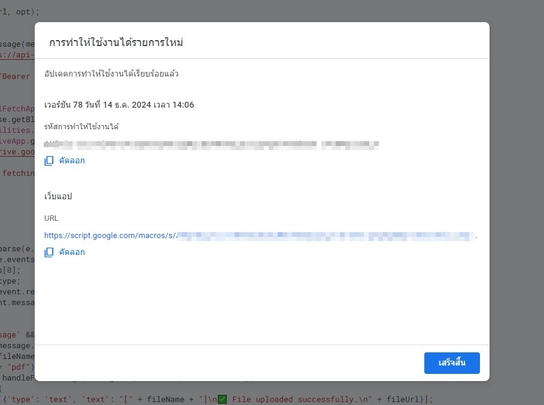
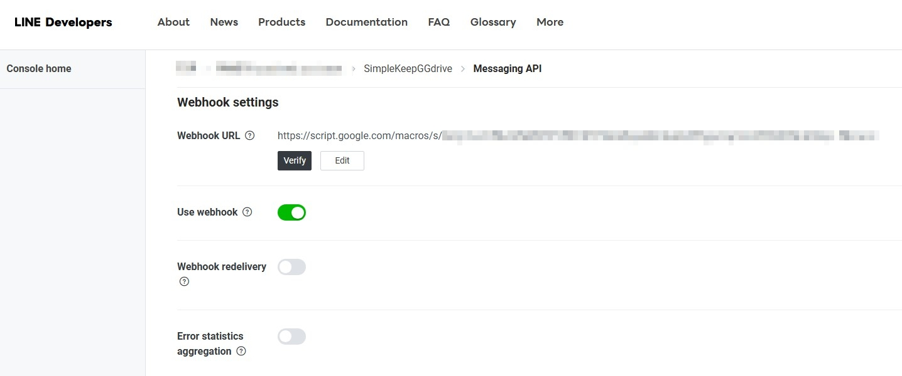

## Line API Bot: Automatically saves files from chat to individual Google Drive (simple) 📂✔️
SimpleKeepGGdrive is a "Messaging API Line bot" designed to store your files in an individual Google Drive. Currently, it supports only PDF files, but you can modify it to support other file types in the simplekeepggdrive.js script.

**SIMPLE VERSION**: not related with command text

## Feature (Customizable)
### 📄 - Keep docx/doc file
<div align="center">
  
</div>

### 📂 - Keep pdf file
<div align="center">
  
</div>

### 🎞️ - Keep video file
<div align="center">
  
</div>

### 📷 - Keep image file
<div align="center">
  
</div>

### 🎵 - Keep audio file
<div align="center">
  
</div>

## How to
Create a new script file or use an existing project. https://script.google.com/home
<div align="center">
  
</div>
<br>

[Copy this code](https://github.com/KnetAttimed/Line-bot-save-files-2GGdrive/blob/main/simplekeepggdrive.js) 

paste the code in your script <br>
Go to Deploy > New Deployment. <br>
Select Web app. <br>
Set the permissions (e.g., "Anyone with the link"). <br>
Deploy and use the generated URL as the webhook endpoint (for LINE or other APIs). <br>
<div align="center">
  
</div>

Paste the URL in the LINE Developer Console
Go to the LINE Developer Console.
Select your LINE Messaging API channel.
In the left menu, click on Messaging API.
Scroll down to the Webhook URL section.
Paste the Web App URL you obtained from your Google Apps Script deployment in the Webhook URL field.
Click Save to apply the settings.
<div align="center">
  
</div>

*Line Bot: You should disable private chat and enable the auto-reply feature.*


### Info:
```
  The project : LINE Messaging API Keep file to Google drive
  Describe : Line API Bot: Automatically saves files from chat to individual Google Drive (simple:not related with command text)
  coding by Knet Attimed (Kiattisak Phothawimoncharat)
  used for learning only. please reference me if any.
  https://github.com/KnetAttimed
```
